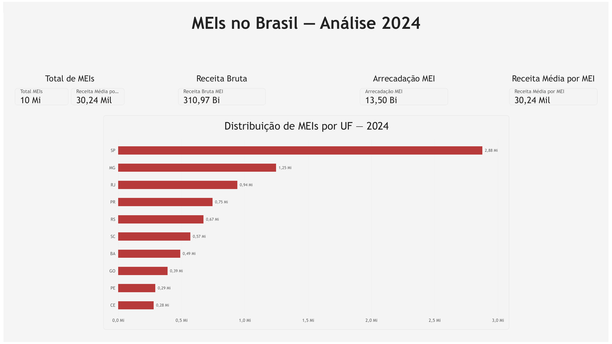
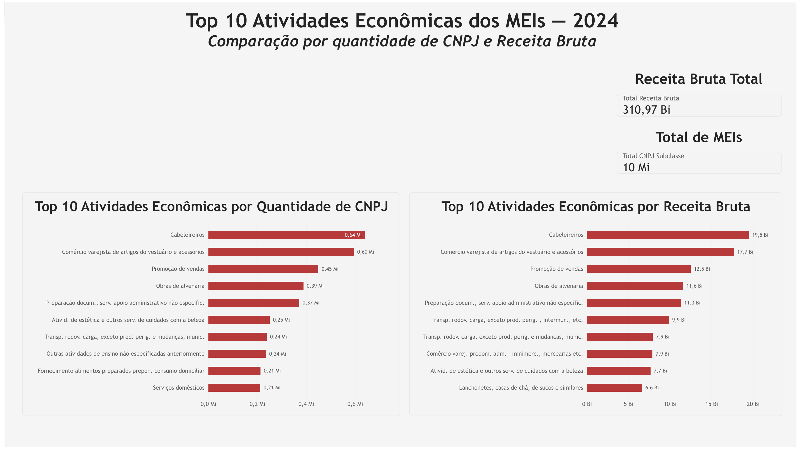

# Raio-X do Empreendedorismo no Brasil: Inteligência de Dados e Concentração de Mercado dos MEIs (2024)

## 1. Sobre o projeto

Este projeto analisa o universo dos Microempreendedores Individuais (MEIs) no Brasil em 2024, utilizando dados da Receita Federal para investigar distribuição geográfica, atividades econômicas, Receita Bruta e arrecadação.

A análise foi desenvolvida no Power BI, combinando Power Query e DAX para transformar dados públicos em indicadores, rankings e dashboards voltados à exploração e interpretação de dados.

## 2. Principais resultados

| Indicador | Resultado |
|---|---:|
| **MEIs analisados** | **≈ 10,3 milhões** |
| **Receita Bruta** | **R$ 310,97 bilhões** |
| **Receita Média por MEI** | **R$ 30,24 mil** |
| **Arrecadação MEI** | **R$ 13,50 bilhões** |

> A análise considera exclusivamente os registros classificados como `SIMPLES - MEI`. As contagens divulgadas pela fonte oficial estão sujeitas às regras de sigilo estatístico.

## 3. Principais insights

### Receita Bruta por atividade

As cinco atividades com maior Receita Bruta entre as subclasses analisadas são:

1. **Cabeleireiros** — **R$ 19,51 bilhões**;
2. **Comércio varejista de artigos do vestuário e acessórios** — **R$ 17,70 bilhões**;
3. **Promoção de vendas** — **R$ 12,49 bilhões**;
4. **Obras de alvenaria** — **R$ 11,58 bilhões**;
5. **Preparação de documentos e serviços especializados de apoio administrativo** — **R$ 11,33 bilhões**.

### Quantidade de CNPJs ≠ Receita Bruta

As atividades com maior quantidade de CNPJs não necessariamente ocupam as mesmas posições no ranking de Receita Bruta, evidenciando a importância de analisar volume e valor conjuntamente.

### Concentração geográfica

As três UFs com maior quantidade de CNPJs na análise são:

- **SP:** 2.877.357;
- **MG:** 1.247.636;
- **RJ:** 940.544.

O dashboard apresenta o **Top 10 por quantidade de CNPJs**.

## 4. Dashboards

### Visão geral dos MEIs

`MEI_Brasil_2024.pbix`

Dashboard com indicadores gerais, Receita Bruta, Receita Média, arrecadação, distribuição por UF e Top 10 UFs.

[](dashboards/MEI_Brasil_2024.pbix)

[⬇ Abrir MEI_Brasil_2024.pbix](dashboards/MEI_Brasil_2024.pbix)

### Análise por atividade econômica

`Fato_MEI_Subclasse.pbix`

Dashboard com quantidade de CNPJs por atividade, Receita Bruta por atividade, rankings Top 10 e comparação entre subclasses CNAE.

[](dashboards/Fato_MEI_Subclasse.pbix)

[⬇ Abrir Fato_MEI_Subclasse.pbix](dashboards/Fato_MEI_Subclasse.pbix)

> As imagens acima são materiais de apresentação do projeto; os arquivos PBIX são os artefatos analíticos principais.

## 5. Recomendações de negócio

Os resultados permitem levantar algumas aplicações práticas para análise e tomada de decisão:

- **Priorização territorial:** UFs com maior concentração de MEIs podem orientar estudos sobre demanda por capacitação, formalização, crédito e serviços de apoio ao empreendedor.
- **Foco setorial:** atividades líderes em quantidade e Receita Bruta podem ser priorizadas em ações de educação financeira, capacitação e programas de desenvolvimento empresarial.
- **Leitura conjunta de volume e valor:** comparar número de CNPJs e Receita Bruta ajuda a identificar segmentos com forte presença empresarial, mas participação econômica proporcionalmente menor ou maior.
- **Aprofundamento analítico:** a combinação de atividade, UF e Receita Bruta pode servir como base para recortes regionais e setoriais mais específicos em estudos posteriores.

> Essas recomendações são hipóteses de aplicação analítica derivadas dos padrões observados nos dados; não representam causalidade nem políticas públicas já implementadas.

## 6. Tecnologias e competências demonstradas

| Tecnologia | Aplicação |
|---|---|
| **Power BI** | Modelagem, indicadores e dashboards |
| **Power Query** | Preparação e transformação dos dados |
| **DAX** | Criação das medidas e indicadores |
| **Git/GitHub** | Versionamento e documentação |
| **Markdown** | Documentação técnica |

## 7. Estrutura e modelagem dos dados

### `MEI_Brasil_2024.pbix`

Base principal: `Secao`.

Utilizada para:

- quantidade de CNPJs;
- Receita Bruta;
- arrecadação;
- distribuição por Unidade da Federação.

### `Fato_MEI_Subclasse.pbix`

Bases utilizadas:

- `Subclasse`;
- `Subclasse (2)`.

Divisão analítica:

- `Subclasse` → Receita Bruta por atividade;
- `Subclasse (2)` → quantidade de CNPJs por atividade.

Durante a auditoria, não foi identificada relação entre `Subclasse` e `Subclasse (2)`. Por isso, o modelo não é apresentado como um **Star Schema**.

## 8. Medidas DAX

### `Total MEIs`

```DAX
Total MEIs =
CALCULATE(
    SUM('Secao'[Qtd_CNPJ]),
    'Secao'[Forma_Tributacao] = "SIMPLES - MEI"
)
```

### `Receita Bruta MEI`

```DAX
Receita Bruta MEI =
CALCULATE(
    SUM('Secao'[Receita_Bruta]),
    'Secao'[Forma_Tributacao] = "SIMPLES - MEI"
)
```

### `Receita Média por MEI`

```DAX
Receita Média por MEI =
DIVIDE(
    [Receita Bruta MEI],
    [Total MEIs]
)
```

### `Arrecadação MEI`

```DAX
Arrecadação MEI =
SUM('Secao'[Arrecadacao_MEI_DAS_MEI])
```

As medidas do `Fato_MEI_Subclasse.pbix` também restringem o universo por `Forma_Tributacao = "SIMPLES - MEI"`.

[Ver documentação completa das medidas DAX](dax/medidas.md)

## 9. Metodologia

A fonte oficial utilizada é a publicação **Dados Setoriais 2024 da Receita Federal do Brasil**, especificamente:

- **01b — Seção (SN e MEI)**;
- **05b — Subclasse (SN e MEI)**.

Como essas tabelas abrangem Simples Nacional e MEI, a análise exclusiva de MEIs utiliza o filtro:

`Forma_Tributacao = "SIMPLES - MEI"`

A tabela 01b é utilizada para os indicadores gerais e a análise por UF. A tabela 05b é utilizada para a análise por subclasse CNAE.

As tabelas são agregadas, não representam uma base transacional individual por CNPJ e possuem regras específicas de divulgação.

[Ver metodologia detalhada](docs/metodologia.md)

## 10. Qualidade e validação

O projeto inclui controles de qualidade para aumentar a confiabilidade dos resultados, incluindo:

- validação da fonte;
- validação do universo `SIMPLES - MEI`;
- verificação das medidas DAX;
- testes de sanidade;
- validação cruzada entre as tabelas 01b e 05b;
- conferência dos filtros e critérios Top N;
- rastreabilidade entre fonte, coluna, filtro, medida e visual;
- avaliação de dimensões de qualidade como validade, consistência, acurácia lógica, completude e unicidade compatíveis com uma fonte agregada.

[Ver controles de qualidade, confiabilidade e validação](docs/qualidade-dados.md)

## 11. Limitações dos dados

As tabelas oficiais utilizadas estão sujeitas a regras de sigilo estatístico. Algumas quantidades podem ser suprimidas em determinadas combinações de classificação e localização.

Por isso, as contagens devem ser interpretadas considerando a cobertura e a granularidade da fonte, e não como uma contagem absoluta sem ressalvas.

Além disso, os dados são agregados e não permitem inferir diretamente o comportamento individual de cada CNPJ.

## 12. Fonte dos dados

**Receita Federal do Brasil — Dados Setoriais 2024**

Tabelas utilizadas:

- `01b — Seção (SN e MEI)`;
- `05b — Subclasse (SN e MEI)`.

Metadados oficiais:

https://www.gov.br/receitafederal/pt-br/centrais-de-conteudo/publicacoes/estudos/pessoas-juridicas-por-setor/estudos-setoriais-das-pessoas-juridicas/dados-setoriais-2024/metadados-dados-setoriais-2024

## 13. Como reproduzir este projeto

1. Obtenha as tabelas oficiais **01b — Seção (SN e MEI)** e **05b — Subclasse (SN e MEI)** a partir dos metadados oficiais da Receita Federal.
2. Utilize a tabela 01b para os indicadores gerais e análise por UF; utilize a tabela 05b para a análise por subclasse CNAE.
3. No Power Query/Power BI, mantenha o universo analítico de MEIs por `Forma_Tributacao = "SIMPLES - MEI"` nas medidas correspondentes.
4. Reproduza as medidas DAX documentadas em `dax/medidas.md`.
5. Replique os critérios Top N utilizando a mesma medida usada como valor do visual.
6. Abra os arquivos `dashboards/MEI_Brasil_2024.pbix` e `dashboards/Fato_MEI_Subclasse.pbix` para consultar os modelos e visuais finais.
7. Valide os resultados utilizando os controles descritos em `docs/qualidade-dados.md`.

> Como as tabelas são agregadas e possuem regras de sigilo estatístico, uma reprodução pode apresentar diferenças de quantidade em recortes específicos sem representar necessariamente erro de cálculo.

## 14. Fluxo analítico

```text
Dados oficiais
      ↓
Power Query
      ↓
Modelagem no Power BI
      ↓
Medidas DAX
      ↓
Indicadores e rankings
      ↓
Dashboards
      ↓
Validação e insights
      ↓
Documentação técnica
```

## 15. Estrutura do repositório

```text
analise-mei-brasil-2024/
├── dashboards/
│   ├── Fato_MEI_Subclasse.pbix
│   └── MEI_Brasil_2024.pbix
├── assets/
│   ├── dashboard_preview_mei_brasil_2024.png
│   └── Fato_MEI_Subclasse_README_visual.png
├── data/
│   └── .gitkeep
├── dax/
│   └── medidas.md
├── docs/
│   ├── insights.md
│   ├── metodologia.md
│   ├── modelo-dados.md
│   └── qualidade-dados.md
├── .gitignore
├── LICENSE
└── README.md
```

## 16. Documentação

- [Metodologia](docs/metodologia.md)
- [Modelo de dados](docs/modelo-dados.md)
- [Insights](docs/insights.md)
- [Qualidade dos dados](docs/qualidade-dados.md)
- [Medidas DAX](dax/medidas.md)

## 17. Licença

O projeto utiliza a licença MIT para o código e a documentação desenvolvidos no repositório.

Os dados de terceiros utilizados na análise permanecem sujeitos às condições de uso e distribuição definidas por seus respectivos responsáveis.

## 18. Status

**Projeto concluído e documentado.**

Os dashboards, medidas, análises, validações e documentação técnica foram revisados e publicados no repositório.
