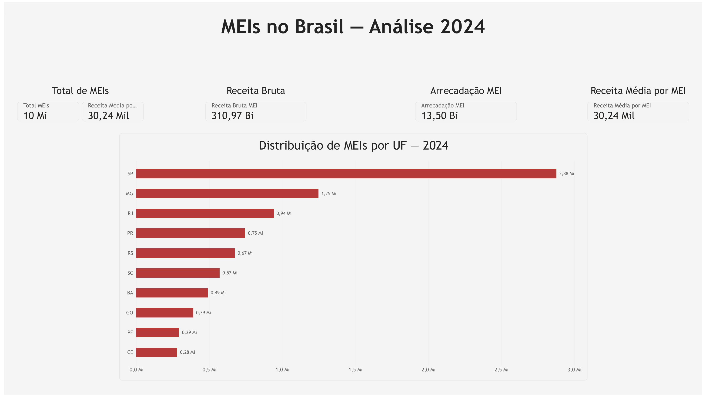
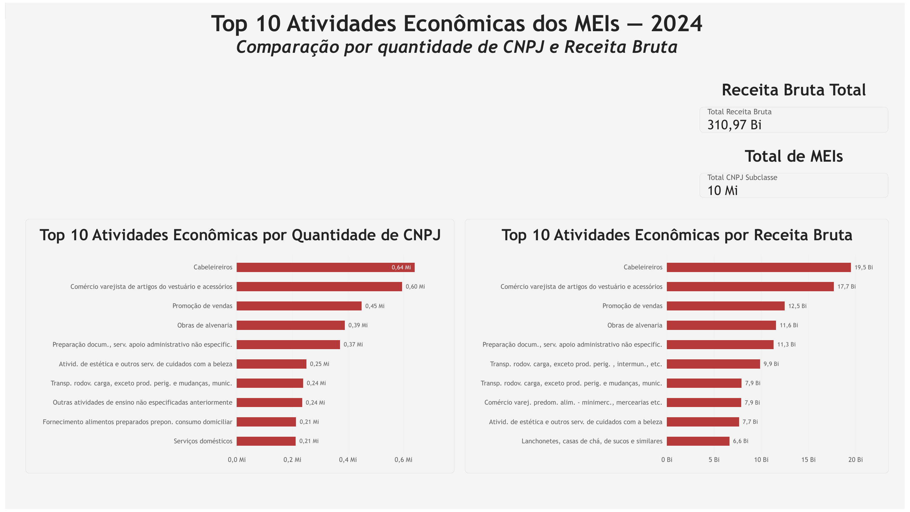

# Raio-X do Empreendedorismo no Brasil: Inteligência de Dados e Concentração de Mercado dos MEIs (2024)

[](#4-dashboards) [](dax/medidas.md) [](https://github.com/peedrovinicius/analise-mei-brasil-2024/actions/workflows/source-audit.yml) [](LICENSE) [](https://github.com/peedrovinicius/analise-mei-brasil-2024/commits/main)

## Visualização rápida





> **Projeto de portfólio em Power BI, Power Query e DAX**, desenvolvido a partir dos **Dados Setoriais 2024 da Receita Federal do Brasil**. O foco é analisar distribuição geográfica, atividades econômicas, Receita Bruta e arrecadação dos Microempreendedores Individuais.

## Principal achado

**Quantidade de empresas e Receita Bruta não contam exatamente a mesma história.** O projeto compara esses dois indicadores para mostrar como a concentração dos MEIs varia por atividade econômica e por Unidade da Federação.

No universo `SIMPLES - MEI`, a Receita Bruta validada é de **R$ 310,97 bilhões**, com receita média calculada sobre a quantidade divulgada de CNPJs de **R$ 30,24 mil** e Arrecadação MEI de **R$ 13,50 bilhões**. Entre as subclasses analisadas, **Cabeleireiros** lideram tanto em quantidade de CNPJs quanto em Receita Bruta.

## 1. Sobre o projeto

Este projeto analisa o universo dos Microempreendedores Individuais (MEIs) no Brasil no **ano-calendário de 2024**, utilizando as tabelas agregadas `01b — Seção (SN e MEI)` e `05b — Subclasse (SN e MEI)` da Receita Federal.

A análise foi desenvolvida no Power BI, combinando Power Query e DAX para preparar os dados, construir indicadores e apresentar rankings e dashboards para exploração dos resultados.

### Pergunta central

**Quantidade de empresas e Receita Bruta contam a mesma história?**

A análise compara volume empresarial e valor econômico sob duas perspectivas complementares: distribuição por Unidade da Federação e análise por atividade econômica/subclasse CNAE.

## 2. Principais resultados

| Indicador | Resultado |
|---|---:|
| **CNPJs MEI divulgados na tabela 01b** | **10.284.095** |
| **CNPJs MEI — total oficial reconciliado** | **10.284.140** |
| **Receita Bruta** | **R$ 310.969.612.070,00** |
| **Receita / quantidade divulgada** | **R$ 30.237,92** |
| **Arrecadação DAS-MEI** | **R$ 13.502.226.249,57** |

> A planilha detalhada `Secao` divulga numericamente 10.284.095 CNPJs. A planilha complementar `Secao < 4` agrega outros 45 CNPJs protegidos nas células detalhadas, reconciliando o total oficial de 10.284.140. A medida DAX atual usa a quantidade divulgada na tabela principal; por isso, sua razão é R$ 30.237,92. Sobre o total reconciliado, a razão seria R$ 30.237,78. Ambas arredondam para R$ 30,24 mil.

## 3. Principais insights

### Receita Bruta por atividade

As cinco atividades com maior Receita Bruta entre as subclasses analisadas são:

1. **Cabeleireiros** — **R$ 19,51 bilhões**;
2. **Comércio varejista de artigos do vestuário e acessórios** — **R$ 17,70 bilhões**;
3. **Promoção de vendas** — **R$ 12,49 bilhões**;
4. **Obras de alvenaria** — **R$ 11,58 bilhões**;
5. **Preparação de documentos e serviços especializados de apoio administrativo** — **R$ 11,33 bilhões**.

### Quantidade de CNPJs ≠ Receita Bruta

As atividades com maior quantidade de CNPJs não necessariamente ocupam as mesmas posições no ranking de Receita Bruta. Por isso, o projeto analisa quantidade e valor separadamente antes de fazer a leitura conjunta.

### Concentração geográfica

As três UFs com maior quantidade de CNPJs na análise são:

- **SP:** 2.877.357;
- **MG:** 1.247.636;
- **RJ:** 940.544.

O dashboard apresenta o **Top 10 por quantidade de CNPJs** e permite ampliar a leitura para a distribuição por UF.

## 4. Dashboards

### Visão geral dos MEIs

`MEI_Brasil_2024.pbix`

Indicadores gerais, Receita Bruta, Receita Média, arrecadação, distribuição por UF e Top 10 UFs.

[](dashboards/MEI_Brasil_2024.pbix)

[Abrir MEI_Brasil_2024.pbix](dashboards/MEI_Brasil_2024.pbix)

[Guia da pasta dashboards](dashboards/README.md)

### Análise por atividade econômica

`Fato_MEI_Subclasse.pbix`

Quantidade de CNPJs por atividade, Receita Bruta por atividade, rankings Top 10 e comparação entre subclasses CNAE.

[](dashboards/Fato_MEI_Subclasse.pbix)

[Abrir Fato_MEI_Subclasse.pbix](dashboards/Fato_MEI_Subclasse.pbix)

> As imagens são prévias para leitura rápida. Os arquivos PBIX são os artefatos analíticos principais.

### Visualização interativa na Web

Os **PBIX são os artefatos analíticos publicados** do projeto. As imagens incluídas no README funcionam como prévias para leitura rápida sem depender da abertura do Power BI Desktop.

## 5. Tecnologias e competências demonstradas

| Tecnologia | Aplicação |
|---|---|
| **Power BI** | Modelagem, indicadores, rankings e dashboards |
| **Power Query** | Preparação e transformação dos dados |
| **DAX** | Criação das medidas e indicadores |
| **Git/GitHub** | Versionamento e documentação |
| **Markdown** | Documentação técnica |

## 6. Dados, recorte e transparência

### Fonte oficial

**Receita Federal do Brasil — Dados Setoriais 2024**.

A publicação corresponde ao **ano-calendário de 2024**. A versão de referência usada nesta auditoria é a publicação oficial atualizada em **09/12/2025**, acompanhada do arquivo **Metadados_AC2024_v1.pdf**. A própria Receita Federal informa que as bases podem sofrer retificações e correções após as extrações; por isso, a data da publicação de referência faz parte da rastreabilidade do projeto.

Tabelas utilizadas:

- **01b — Seção (SN e MEI)**: visão geral e análise por Unidade da Federação.
- **05b — Subclasse (SN e MEI)**: análise por atividade econômica/CNAE.

### Regra de universo

As tabelas de origem abrangem **Simples Nacional e MEI**. Por isso, os indicadores apresentados como MEI utilizam explicitamente:

```text
Forma_Tributacao = "SIMPLES - MEI"
```

### O que foi tratado

O fluxo de preparação foi estruturado por perspectiva analítica:

1. seleção das tabelas oficiais adequadas ao nível de análise;
2. uso do campo `Forma_Tributacao` para isolar `SIMPLES - MEI`;
3. organização dos campos de quantidade, Receita Bruta, arrecadação, UF e subclasse CNAE, preservando a rastreabilidade entre os nomes oficiais e os nomes adotados no modelo;
4. construção das medidas DAX utilizadas pelos dashboards;
5. validação dos indicadores e rankings contra a fonte e entre as tabelas utilizadas.

Não foi utilizada uma base transacional com 10 milhões de linhas. O valor de **≈ 10,3 milhões** representa um indicador agregado de quantidade de CNPJs no universo analisado; não significa que o Power BI esteja processando 10 milhões de registros individuais de CNPJ.

### Nulos, duplicidades e anonimização

A fonte utilizada neste projeto é **agregada**, não uma relação individual de CNPJs. Por isso, não foram realizados testes tradicionais de unicidade por CNPJ nem deduplicação de registros individuais. As limitações e regras de sigilo estatístico são consideradas na interpretação das contagens.

Os arquivos publicados neste repositório não expõem uma base transacional individual de CNPJs. Por essa razão, o projeto descreve o dado como **agregado** em vez de atribuir uma classificação jurídica adicional de “anonimizado”.

## 7. Estrutura e modelagem dos dados

### `MEI_Brasil_2024.pbix`

Base principal: `Secao`.

Utilizada para:

- quantidade de CNPJs;
- Receita Bruta;
- arrecadação;
- distribuição por Unidade da Federação.

### `Fato_MEI_Subclasse.pbix`

Bases utilizadas:

- `Subclasse`;
- `Subclasse (2)`;
- `Dim_CNAE`.

Divisão analítica:

- `Subclasse` → Receita Bruta por atividade;
- `Subclasse (2)` → quantidade de CNPJs por atividade;
- `Dim_CNAE` → dimensão compartilhada de atividade econômica utilizada pelas duas tabelas.

`Subclasse` e `Subclasse (2)` não possuem relacionamento direto entre si. Ambas se relacionam com `Dim_CNAE`, que fornece a referência comum das descrições de subclasse CNAE.

A estrutura atual **não é apresentada como um Star Schema completo**. A decisão de separar as perspectivas em dois PBIX e manter `Dim_CNAE` como dimensão compartilhada atende ao escopo analítico atual sem afirmar uma modelagem dimensional clássica que o modelo não possui.

## 8. Medidas DAX

### `Total MEIs`

```DAX
Total MEIs =
CALCULATE(
    SUM('Secao'[Qtd_CNPJ]),
    'Secao'[Forma_Tributacao] = "SIMPLES - MEI"
)
```

### `Receita Bruta MEI`

```DAX
Receita Bruta MEI =
CALCULATE(
    SUM('Secao'[Receita_Bruta]),
    'Secao'[Forma_Tributacao] = "SIMPLES - MEI"
)
```

### `Receita Média por MEI`

```DAX
Receita Média por MEI =
DIVIDE(
    [Receita Bruta MEI],
    [Total MEIs]
)
```

Essa medida usa a quantidade numericamente divulgada na tabela principal `Secao` e corresponde a R$ 30.237,92 na publicação de referência. A planilha complementar permite reconciliar o total nacional em 10.284.140 CNPJs; usando esse denominador, a razão é R$ 30.237,78.

### `Arrecadação MEI`

```DAX
Arrecadação MEI =
SUM('Secao'[Arrecadacao_MEI_DAS_MEI])
```

### `Total CNPJ Subclasse`

```DAX
Total CNPJ Subclasse =
CALCULATE(
    SUM('Subclasse (2)'[Qtd_CNPJ]),
    'Subclasse (2)'[Forma_Tributacao] = "SIMPLES - MEI"
)
```

### `Total Receita Bruta`

```DAX
Total Receita Bruta =
CALCULATE(
    SUM('Subclasse'[Receita_Bruta]),
    'Subclasse'[Forma_Tributacao] = "SIMPLES - MEI"
)
```

Os visuais de Top 10 utilizam a medida analítica correspondente como referência do ranking, mantendo coerência entre a métrica exibida e o critério de seleção do Top N quando aplicável.

[Ver documentação completa das medidas DAX](dax/medidas.md) · [Guia da pasta DAX](dax/README.md)

## 9. Metodologia e ETL

A fonte oficial fornece tabelas agregadas por níveis diferentes de classificação. O projeto mantém cada perspectiva em um relatório próprio para preservar a leitura dos indicadores.

### Fluxo

```text
Receita Federal
      ↓
Tabelas 01b / 05b
      ↓
Power Query
      ↓
Recorte SIMPLES - MEI
      ↓
Modelo Power BI
      ↓
Medidas DAX
      ↓
Rankings e dashboards
      ↓
Insights e validações
```

### Granularidade

- **Tabela 01b:** Seção × Unidade da Federação × Forma de Tributação;
- **Tabela 05b:** Subclasse CNAE × Unidade da Federação × Forma de Tributação.

Por essa razão, os resultados não representam uma base de detalhe transacional por CNPJ individual.

[Ver metodologia detalhada](docs/metodologia.md)

## 10. Qualidade e validação

O projeto inclui controles de qualidade para aumentar a confiabilidade dos resultados, incluindo:

- validação da fonte;
- validação do universo `SIMPLES - MEI`;
- verificação das medidas DAX;
- testes de sanidade;
- validação cruzada entre as tabelas 01b e 05b;
- conferência dos filtros e critérios Top N;
- rastreabilidade entre fonte, coluna, filtro, medida e visual.

Um teste de sanidade importante identificou que **R$ 2,48 trilhões** não representava a Receita Bruta exclusiva de MEIs: esse valor resultava da mistura de `SIMPLES` e `SIMPLES - MEI`. O universo correto produz **R$ 310,97 bilhões** para `SIMPLES - MEI`.

[Ver controles de qualidade, confiabilidade e validação](docs/qualidade-dados.md) · [Auditoria independente da fonte oficial](docs/auditoria-fonte-oficial.md)

## 11. Performance

Não foi documentado um cenário de otimização baseado em “10 milhões de linhas”, porque **≈ 10,3 milhões é um indicador agregado e não o número de linhas processadas de uma base individual de CNPJs**.

Os principais cuidados de desempenho estão relacionados à manutenção de modelos separados por perspectiva e ao uso de tabelas agregadas da fonte, evitando introduzir no projeto uma alegação de particionamento ou otimização que não foi efetivamente aplicada e validada.

## 12. Recomendações de negócio e próximos desdobramentos

Os achados permitem levantar hipóteses de aplicação para priorização territorial, análise setorial e aprofundamento da relação entre quantidade de empresas e Receita Bruta.

A concentração observada em determinadas UFs pode orientar investigações territoriais mais detalhadas, enquanto a comparação entre quantidade de CNPJs e Receita Bruta ajuda a evitar o uso de volume empresarial como único indicador de relevância econômica.

Como possíveis extensões, o projeto pode incorporar análises históricas, razões entre Receita Bruta e quantidade divulgada por atividade e UF, participação percentual por segmento e mudanças de concentração ao longo do tempo.

Essas recomendações são hipóteses analíticas e não representam relações causais comprovadas pelos dados.

[Ver recomendações e próximos desdobramentos](docs/recomendacoes-negocio.md)

## 13. Limitações dos dados

As tabelas oficiais utilizadas estão sujeitas a regras de sigilo estatístico. Algumas quantidades podem ser suprimidas em determinadas combinações de classificação e localização.

Por isso, os rankings e células detalhadas devem respeitar as supressões. Para o total nacional, porém, as planilhas complementares da própria publicação permitem reconciliar exatamente **10.284.140 CNPJs** no universo `SIMPLES - MEI`.

Além disso, os dados são agregados e não permitem inferir diretamente o comportamento individual de cada CNPJ.

## 14. Fonte dos dados

**Receita Federal do Brasil — Dados Setoriais 2024**

Tabelas utilizadas:

- `01b — Seção (SN e MEI)`
- `05b — Subclasse (SN e MEI)`

Fontes oficiais:

- [Dados Setoriais 2024 — Receita Federal](https://www.gov.br/receitafederal/pt-br/centrais-de-conteudo/publicacoes/estudos/pessoas-juridicas-por-setor/estudos-setoriais-das-pessoas-juridicas/dados-setoriais-2024)
- [Tabela 01b — Seção (SN e MEI)](https://www.gov.br/receitafederal/pt-br/centrais-de-conteudo/publicacoes/estudos/pessoas-juridicas-por-setor/estudos-setoriais-das-pessoas-juridicas/dados-setoriais-2024/tabela-01b-secao-sn-e-mei/view)
- [Tabela 05b — Subclasse (SN e MEI)](https://www.gov.br/receitafederal/pt-br/centrais-de-conteudo/publicacoes/estudos/pessoas-juridicas-por-setor/estudos-setoriais-das-pessoas-juridicas/dados-setoriais-2024/tabela-05b-subclasse-sn-e-mei/view)
- [Metadados — Dados Setoriais 2024](https://www.gov.br/receitafederal/pt-br/centrais-de-conteudo/publicacoes/estudos/pessoas-juridicas-por-setor/estudos-setoriais-das-pessoas-juridicas/dados-setoriais-2024/metadados-dados-setoriais-2024/view)

## 15. Como reproduzir este projeto

### Pré-requisitos

- **Power BI Desktop**;
- acesso à publicação oficial **Dados Setoriais 2024** da Receita Federal;
- noções básicas de Power Query e DAX para reproduzir ou auditar as transformações e medidas.

### Passo a passo

1. Baixe as tabelas oficiais **01b** e **05b** da publicação **Dados Setoriais 2024**. Para reproduzir os números documentados, use como referência os arquivos publicados/atualizados em **09/12/2025** e confira os metadados **Metadados_AC2024_v1.pdf**.
2. Abra o relatório correspondente:
   - `dashboards/MEI_Brasil_2024.pbix` para a visão geral e UF;
   - `dashboards/Fato_MEI_Subclasse.pbix` para as atividades econômicas.
3. Confira o recorte:

```text
Forma_Tributacao = "SIMPLES - MEI"
```

4. Confira as medidas DAX em [`dax/medidas.md`](dax/medidas.md) e [`dax/README.md`](dax/README.md).
5. Consulte [`docs/qualidade-dados.md`](docs/qualidade-dados.md) para os controles de validação.
6. Use a documentação de cada camada para rastrear fonte, campo, medida e visual.

> Os PBIX publicados já contêm os modelos e visuais utilizados no projeto. A reprodução integral pode depender de nova importação/atualização das fontes oficiais e das condições da versão do Power BI Desktop utilizada.

## 16. Estrutura do repositório

```text
analise-mei-brasil-2024/
├── dashboards/
│   ├── Fato_MEI_Subclasse.pbix
│   ├── MEI_Brasil_2024.pbix
│   └── README.md
├── assets/
│   ├── dashboard_preview_mei_brasil_2024.png
│   └── Fato_MEI_Subclasse_README_visual.png
├── data/
│   └── README.md
├── dax/
│   ├── medidas.md
│   └── README.md
├── docs/
│   ├── auditoria-fonte-oficial.md
│   ├── auditoria-pbix.md
│   ├── dicionario-dados.md
│   ├── insights.md
│   ├── metodologia.md
│   ├── modelo-dados.md
│   ├── qualidade-dados.md
│   └── recomendacoes-negocio.md
├── scripts/
│   ├── validate_official_data.py
│   └── validate_pbix_structure.py
├── .github/
│   └── workflows/
│       └── source-audit.yml
├── requirements-audit.txt
├── .gitignore
├── LICENSE
└── README.md
```

## 17. Documentação

- [Guia dos dashboards](dashboards/README.md)
- [Guia dos dados](data/README.md)
- [Guia DAX](dax/README.md)
- [Medidas DAX](dax/medidas.md)
- [Metodologia](docs/metodologia.md)
- [Modelo de dados](docs/modelo-dados.md)
- [Insights](docs/insights.md)
- [Qualidade dos dados](docs/qualidade-dados.md)
- [Recomendações de negócio](docs/recomendacoes-negocio.md)
- [Dicionário de dados](docs/dicionario-dados.md)
- [Auditoria independente da fonte oficial](docs/auditoria-fonte-oficial.md)
- [Auditoria estrutural dos PBIX](docs/auditoria-pbix.md)

## 18. Licença

O projeto utiliza a licença MIT para o código e a documentação desenvolvidos no repositório.

Os dados de terceiros utilizados na análise permanecem sujeitos às condições de uso e distribuição definidas por seus respectivos responsáveis.

## 19. Contato

[LinkedIn — Pedro Vinícius](https://www.linkedin.com/in/peedrovinicius)

## 20. Status

**Projeto concluído e documentado.**

Os dashboards, medidas, análises, validações e documentação técnica foram revisados e publicados no repositório.
